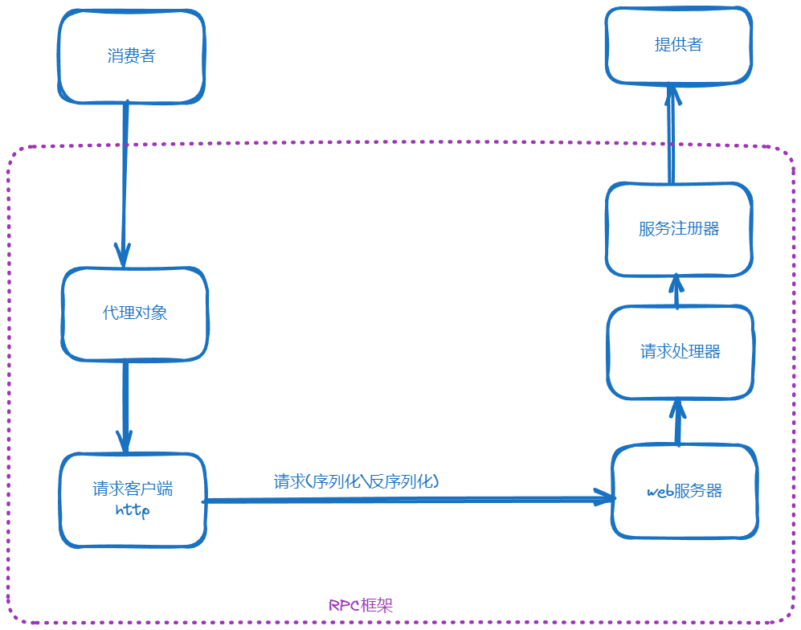
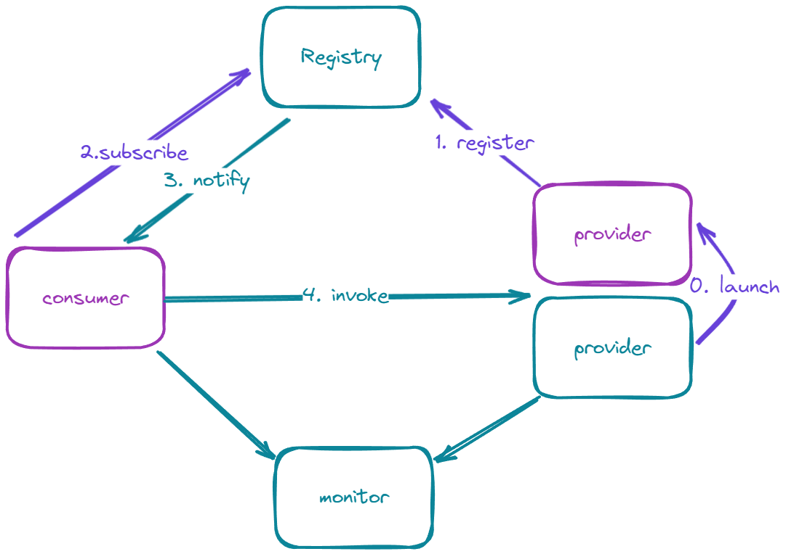

# RPC 基本架构

# TODO
1. 全局加载器
- 支持.properties, yaml和yml格式格式的全局加载器
- 监听热加载
2. Mock接口
3. 动态序列化器
4. SPI 加载
5. 注册中心
6. 自定义Rpc协议
7. 负载均衡
8. 重试机制
9. 容错机制
10. 启动机制和注解驱动
11. 支持参数列表和安全校验
12. 管理界面
13. 拦截器机制
14. 自定义异常
15. 支持服务分组
16. 超时处理

# ref
