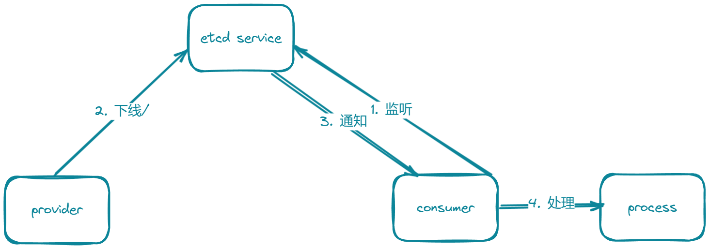
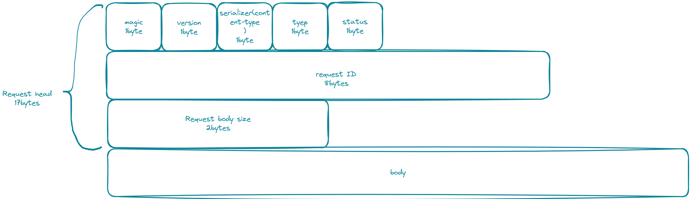
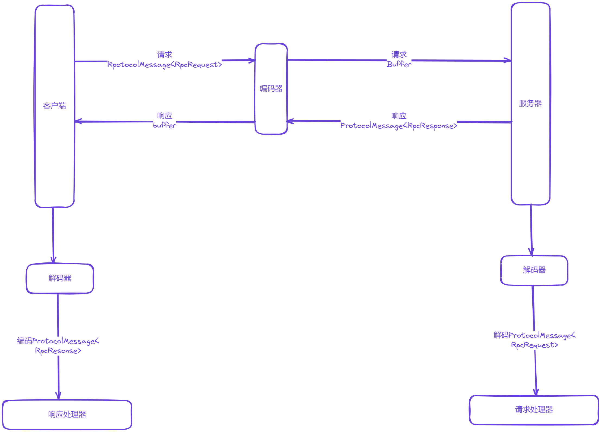

用于记录工作, 之后会完善....
# RPC 基本架构

# TODO
### http请求
- 基于Vertx的http请求响应
### 全局加载器 
- 支持properties, yaml和yml格式格式的全局加载器
- 监听热加载 
### Mock接口
 - MockServiceProxy 模拟对象代理
 - python的faker库生成测试数据 
### SPI动态加载动态序列化器
 - 支持使用SPI机制动态加载序列化器 
   - 在`resources/META-INF/rpc`自定义定义SPI的api接口
   - SpiLoader 使用双检锁模式, SerializerFactory 使用静态内部类模式实现懒加载
 - 支持多种序列化器
   - Json
   - FastJson
   - hessian
   - kryo
   - protostuff
### 注册中心
- 使用etcd的注册中心实现
- 心跳检测实现
  - 维护一个本地注册节点集合, 续期集合内的key
  - 服务注册时设置TTL, 维护TTL信息并在过期的时候删除该服务, 定期请求Etcd续签重写TTL。
- 服务节点下线机制
  - 使用JVM的shutdown停机
- 本地服务缓存
  - 维护一个本地的服务信息的缓存列表
  - 缓存更新的监听机制, 使用etcd的watch监听key发生修改或删除的时候, 触发事件通知监听者
    
- 支持zookeeper实现的注册中心
  - 使用curator操作zookeeper
### 自定义Rpc协议
- 自定义网络传输
- 自定义信息结构
  
  用byte数组拼接消息
- 实现消息编码器和消息解码器, 将java的消息对象和字节数组互相转化
    
- 使用netty的pipeline组合多个handler, 请求处理器接受请求，通过反射调用服务实现类
- 解决半包: 在消息头中设置请求体的长度，服务端接受时，判断每次消息的长度是否符合预期，不完整就不读，留到下一次接收到消息的时候再读
- 解决粘包: 每次只读指定长度的数据, 超过长度的留着下一次接收到消息再读
- 使用RecordParser来指定长度
  - 先读取请求头信息(请求头的长度固定)，再根据请求头中的消息长度信息来更改RecordParser的长度
### 负载均衡
 - 实现轮询、随机、一致性hash负载均衡算法
 - 一致性hash
   - 解决节点下线
   - 解决倾斜问题
### 重试机制
### 容错机制
### 启动机制和注解驱动
### 支持参数列表和安全校验
### 管理界面
### 拦截器机制
### 自定义异常
### 支持服务分组
### 超时处理

# 处理日志
[处理记录](doc/debug_log.md)
